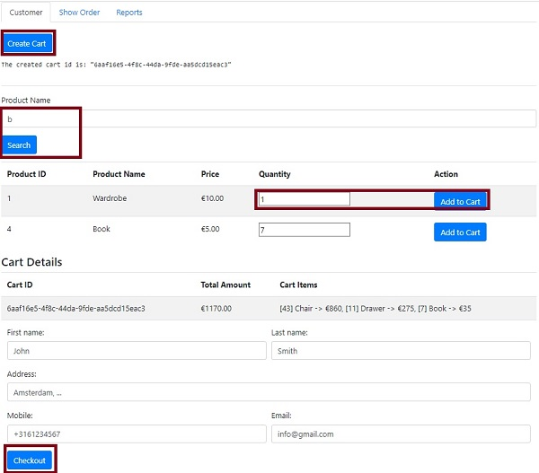
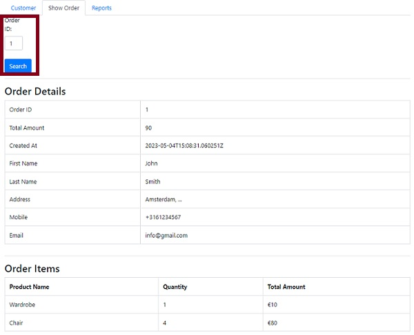
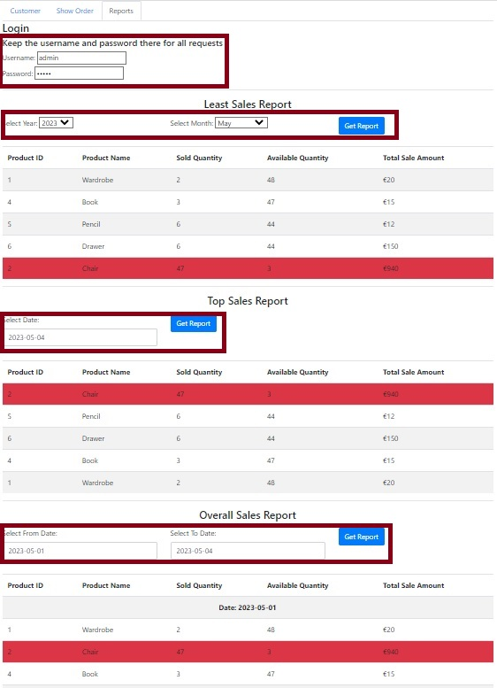

# Retail Webshop Assignment

## Projects
This solution consists two projects:

### REST API Engine
This project uses OpenAPI to provide endpoints for a RESTful API. The API has two different types of
endpoints: `client-api` and `management-api`. The `client-api` is accessible to everyone, while 
the `management-api` is only available to employees with a valid username and password.

To provide documentation for the API, the project also includes `Swagger UI` accessible through 
the http://localhost:8080/swagger-ui/index.html. The project uses `MapStruct`, `JPA`, `H2 database`,
and `Liquibase`. 

Additionally, the project includes implementations for sending email via Gmail and sending SMS 
messages via Twilio. However, these features are disabled by default. To enable them, you must 
update the `application.properties` file accordingly.

The project includes different layers of tests, including unit and integration tests. However, due
to lack of time, only a portion of the tests have been fully implemented.

- To run: `mvn spring-boot:run`
- The default port is 8080.
- There are a couple of prefilled records for the products.
- Java 17
- mvn

### Sample Graphic User Interface
The purpose of this project is to showcase the different endpoints and provide a testing platform 
for a REST API Engine project. With the provided GUI, you can easily interact with the REST APIs and 
test its functionality. Additionally, a few default products have been added to the project to 
make it easier to use the endpoints.

- To run: `mvn spring-boot:run`
- The default port is 8082
- This solution was primarily focused on providing a REST API and the GUI was created as an extra feature.
As a result, the GUI was created without much attention to best practices in the front-end layer.

#### How to use GUI
The GUI offers three distinct tabs, each with a unique purpose. 

The first tab contains all 
publicly accessible APIs. By clicking on the `Create Cart` button, a new cart ID is generated and 
returned to the user for use in subsequent actions. In real-world use cases, the cart ID should be 
saved in the user's cookies on the front-end side. To add a product to the cart, the user can search
for a specific product, specify the desired quantity, and then click on the `Add to Cart` button. 
The cart ID must be provided for any action related to the cart. Upon clicking the `Checkout` button, 
the order will be processed and an order ID will be displayed.

In the second tab, by providing the order id, you can view the order detail. It is important to 
mention, this endpoint is secure, but for the demonstration, the correct username and password are 
currently being passed in order to obtain the desired result.

The final tab, it provides access to reports that contain valuable insights about the business.
Authentication is required to access any of the reports. REST API engine use the username and password 
to grant authorized access. Changing the authentication credentials would result in the reports 
being unavailable.
There are three reports available. The first report displays the five least selling products in a 
specific month of the year. The second report presents the top five products that were sold on 
a particular date. The last report shows the overall sales between two selected dates. 
The user can select the dates by using date pickers provided on the interface.

